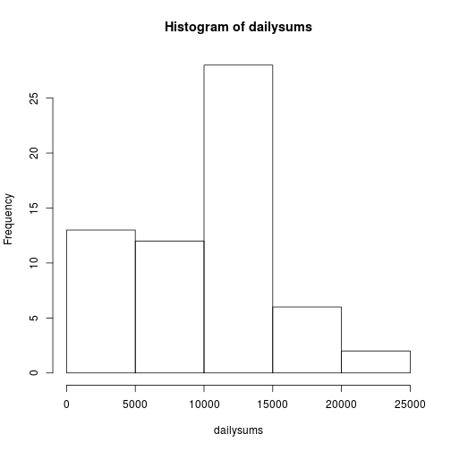
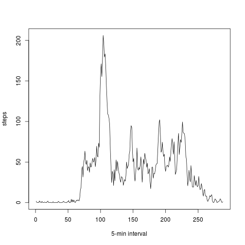
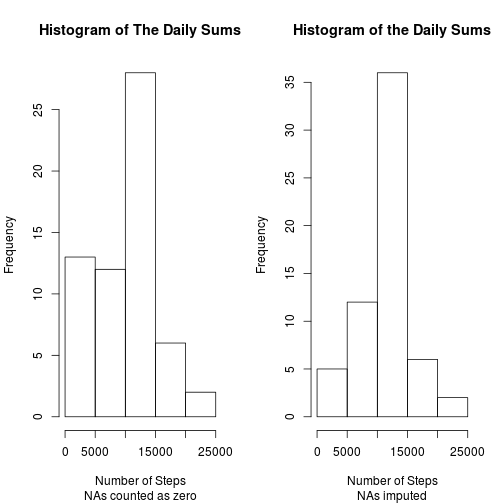
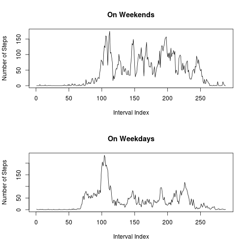

## Load the Required Data for Analysis
Assuming that the data is in the current working directory and named "activity.csv", read into a dataframe called DFActivity.


```r
DFActivity <- read.csv("activity.csv", colClasses = c("numeric", "character", "numeric"))
```

Format the time in DFActivity. Original format: an integer with the thousands and hundreds digits representing the hour and the next two representing the minute. Target format: string hh:mm . Uing sprintf to do the job. Will extract hour and minute with the remainder and the integer quotient operators. In addition to making the intervals readable, this also helps sorting the times.


```r
hr <- DFActivity$interval %/% 100
mn <- DFActivity$interval %% 100
DFActivity$interval <- sprintf("%02d:%02d", hr, mn)
```

## What is mean total number of steps taken per day?

First of all, we create a vector of the step total from each day, naming it "dailysums". NAs count as zero towards the sum.

```r
dailysums <- tapply(DFActivity$steps, as.factor(DFActivity$date), FUN = sum, na.rm = TRUE)
```

And here's a histogram about the distribution daily step totals:

```r
hist(dailysums)
```

 

Now, compute the daily means and medians.

```r
dailymean <- mean(dailysums)
dailymedian <- median(dailysums)
```

From the data, it can be computed that the mean of the daily step sums is 9354.2295082, while the median is 1.0395 &times; 10<sup>4</sup>.


## What is the average daily activity pattern?

First of all, compute interval averages over all days. NAs don't count toward the mean.


```r
averageday <- tapply(X = DFActivity$steps, INDEX = DFActivity$interval, FUN = mean, na.rm = TRUE)
```

Plot the steps against the intervals


```r
plot(averageday, type = "l", xlab = "5-min interval", ylab = "steps")
```

 

From the averageday named vector, it can be known that the interval with the most steps is the one starting at 08:35. There are, on average, 206.1698113 steps in that interval.

## Imputing missing values

First of all, we count the NAs for each column.


```r
nasteps <- sum(is.na(DFActivity$steps))
nadate <- sum(is.na(DFActivity$date))
nainterval <- sum(is.na(DFActivity$interval))
```

There are 2304 rows where NAs exist for steps, 0 rows where NAs exist for date, and 0 rows where NAs exist for interval.

It can be seen that NAs only exist in the steps column, simplifying matters.

Now, impute the NAs. This will be done in-place. A new data frame will not be created. NA's will be replaced with the numbers of steps in the interval on an average day. The imputed steps data will be stored in a new row instead.


```r
DFActivity$steps2 <- DFActivity$steps
for(i in which(is.na(DFActivity$steps2))) { # apply over all columns with NAs
  DFActivity$steps2[i] <- averageday[DFActivity$interval[i]]
}
```

Create a new daily sum from the modified data set and plot a plot comparing it with the original dailysums.


```r
dailysums2 <- tapply(DFActivity$steps2, as.factor(DFActivity$date), FUN = sum)
par(mfrow = c(1,2))
hist(dailysums, main = "Histogram of The Daily Sums", sub = "NAs counted as zero", xlab = "Number of Steps")
hist(dailysums2, main = "Histogram of the Daily Sums", sub = "NAs imputed", xlab = "Number of Steps")
```

 

```r
par(mfrow = c(1,1))
```
## Are there differences in activity patterns between weekdays and weekends?

First, add a weekdays row to the data frame


```r
DFActivity$weekday <- strptime(DFActivity$date, format = "%Y-%m-%d")$wday
```

Then, split the dataframe by weekday. A rather weird way is used to avoid confusion when running the script across different locales.


```r
DFWeekend <- DFActivity[DFActivity$weekday == 0 | DFActivity$weekday == 6,]
DFWeekday <- DFActivity[!(DFActivity$weekday == 0 | DFActivity$weekday == 6),]
```

Finally, generate data and plot data.


```r
averageweekend <- tapply(X = DFWeekend$steps, INDEX = DFWeekend$interval, FUN = mean, na.rm = TRUE)
averageweekday <- tapply(X = DFWeekday$steps, INDEX = DFWeekday$interval, FUN = mean, na.rm = TRUE)
par(mfrow = c(2,1))
plot(averageweekend, type = "l", xlab = "Interval Index", ylab = "Number of Steps", main = "On Weekends")
plot(averageweekday, type = "l", xlab = "Interval Index", ylab = "Number of Steps", main = "On Weekdays")
```

 
